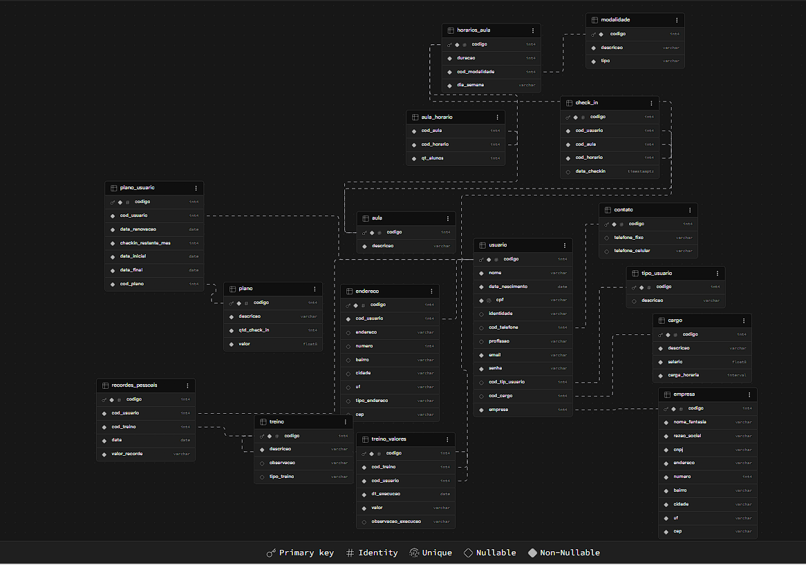

# 📱 Projeto Academia App

## 📌 Resumo
Aplicativo multiplataforma para gestão de aulas e check-in em academias, boxes de crossfit e estúdios.  
Objetivo: simplificar o processo de check-in, agenda de aulas e comunicação entre alunos e gestores.

---

## 🛠️ Tecnologias
- *Backend:* Node.js (Express/NestJS)
- *Mobile:* React Native
- *Web:* React / Next.js
- *Banco de Dados:* PostgreSQL
- *ORM:* Prisma ou Sequelize
- *Hospedagem:* Supabase / Railway (fase inicial)

- Mais detalhes tecnicos estaram disponiveis na [documentação](docs/informacoes_tecnicas.md)

---

## 📑 Decisões Técnicas
- Banco relacional escolhido: *PostgreSQL* (pela robustez e escalabilidade).
- API única em Node.js para atender web e mobile.
- Estrutura inicial focada nas funções do aluno (check-in, agenda, planos).
- Painel administrativo do gestor será desenvolvido em fase posterior.

---

## 🗂️ Estrutura do Banco (ER)
Tabelas principais:
- *usuarios* → cadastro de alunos e gestores
- *aulas* → informações de treinos e horários
- *checkins* → registro de presença dos alunos
- *planos* → tipos de assinatura
- *usuarios_planos* → vínculo entre alunos e planos

---

## 🚀 Roadmap
- [x] Definição inicial do projeto
- [x] Escolha de tecnologias
- [x] Modelagem do banco (ER Diagram)
- [ ] Construção do MVP (check-in, agenda, notificações)
- [ ] Validação em box de crossfit
- [ ] Ajustes e expansão para academias locais
- [ ] Escalabilidade com modelo SaaS

---

## 📂 Organização do Projeto

- academia-app
  - README.md
  - backend
    - ...
  - frontend-web
    - ...
  - frontend-mobile
    - ...
  - docs
    - er-diagrama.png
    - arquitetura.md
    - decisoes-tecnicas.md

## 📣 Marketing e Expansão
- Estratégia inicial: boca a boca e redes sociais.
- Parcerias com coaches e influenciadores fitness locais.
- Futuro: integração com franquias e grandes grupos de academias.